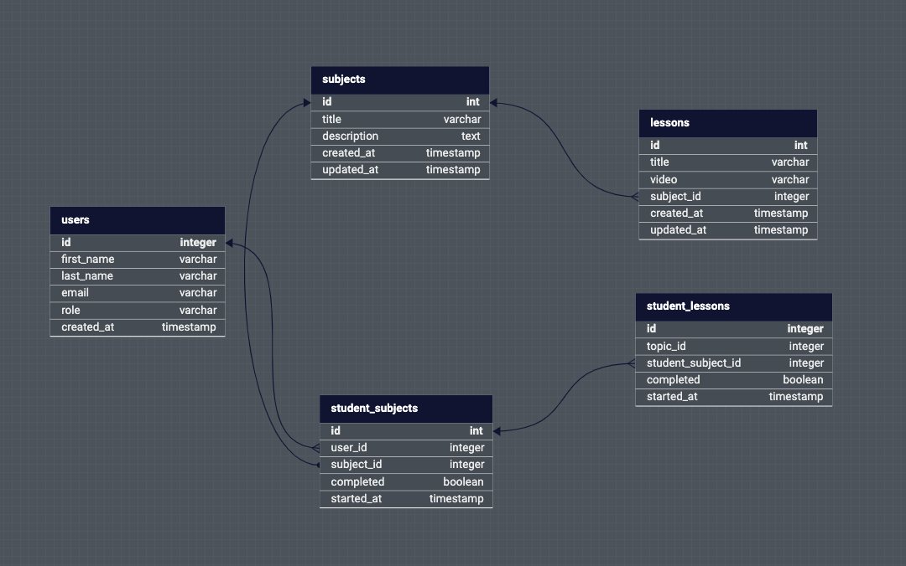

# ETAP LMS

ETAP LMS is a simple learning app.

![MIT License][license-shield]

## Table of Contents

- [ETAP LMS](#etap-lms)
  - [Table of Contents](#table-of-contents)
- [Overview](#overview)
- [Assumptions](#assumptions)
- [Setup](#setup)
  - [Installation](#installation)
  - [Usage](#usage)
  - [Credentials](#credentials)

---

# Overview

DB Schema


- Technology used in the Frontend: React, Typescript, Tailwind, Zustand (for state management).
- Technology used in the Frontend: Express, Typescript, Postgres, Prisma.
- Key features
  - Authentication with JWT
  - Role Based Authtorization
  - New users can sign up
  - Users can easily navigate through subjects and lessons.
  - Users can easily access subjects they already started.
  - Users can start and finish subjects and lessons
  - Teachers can easily navigate through subjects and lessons.
  - Teachers can track learners of a subject and see their rankings.

# Assumptions
These are some assumptions made when developing this application:

- Teachers and admins already exists in the system.
- The subjects and lessons already exists.
- The system is a passwordless application.
- All lesson videos are youtube videos.
- This application is only to be used on a desktop screen (no compatibility with mobile screens).

# Setup

## Installation

Pre-requisite: Make sure you have [docker][dc] setup on your machine.

1. Clone the repository:

```bash
$ git clone https://github.com/ebukaodini/etap-lms.git
```

2. Install dependedncies on each service

```bash
$ cd api && npm install
$ cd .. # return to root folder
$ cd app && npm install
```

3. Setup environment variables:

```bash
$ cp api/.env.sample api/.env
$ cp app/.env.sample app/.env 
```

4. Build the docker image and spin up services:

```bash
$ docker-compose up -d --build
```

## Usage

Open the application on your browser: [`http://localhost:4000`][app] 

## Credentials
These are the default accounts seeded into the database. Use them for different the roles.

- jack.doe@example.com - `ADMIN`
- jane.doe@example.com - `TEACHER`
- john.doe@example.com - `LEARNER`

[dc]: https://docs.docker.com/compose/
[app]: http://localhost:4000
[license-shield]: https://img.shields.io/github/license/ebukaodini/etap-lms.svg?style=flat-square